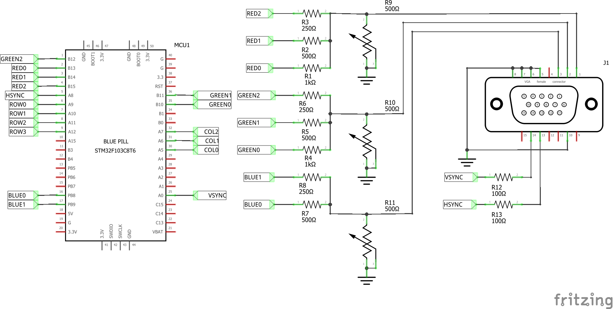

# 8-bit color VGA display for STM32F103C8T6 (Blue Pill)

A working example for 1-bit(monochrome) VGA display for Blue Pill board using (mainly)HAL API.

### What is inside this example:
- An example to use DMA-to-Peripheral for STM32 to push output patterns (8 bits at once). Here, we send the output via DAC using resistors as R/G/B signals for VGA display
- An example to generate H-sync and V-sync for VGA display at 800x600@56Hz
- A simple Tetris game to show an implementation of using GPIO input alongside the VGA display code.

## Video Mode and Timing
SVGA 800x600 @56 Hz

Pixel frequency: 36MHz

### Horizontal timing:

Visible Area 800px.  
Front porch 24px.  
Sync pulse 72px.  
Back porch 128px.  
Whole Line 1024px.

### Vertical timing:

Visible Area 600 lines.  
Front porch 1 line.  
Sync pulse 2 lines.  
Back porch 22 lines.  
Whole frame 625 lines.

## Important Note

- This example uses DMA memory-to-Peripheral with a very high speed.. If you implement with program that requires DMA transfer for other things or using NVIC, it will affect the display in the from of flickering, horizontal shifting or anything else. So please keep in mind.
- Port PB8-PB15 are used for outputing the RGB signals. However the program code sends the whole byte to PB register directly and affect all the output for PB (from PB0 to PB15). So you can not use PB0-PB7 as GPIO output.
- We send the output signal at 1/8 of VGA output (at 4.5 MHz instead of 36 MHz). Thus, the actual resolution is down to 100x600px. To keep the aspect ratio, I have to send each line 8 times, so the resolution is actually 100x75px.

## Circuit diagram:

We use STM32F103C8T6 (Blue pill) in this project, you might substitute with CBT6 but not C6T6 as its RAM is too small for this project.

TIM1 and TIM2 are used to generate H-sync and V-sync signals for VGA output. TIM4 generates a time-base signal for DMA transfer. 

8-bit data are pushed at the same time through PB8 to PB15 by accessing register address of PB directly. PB8/PB9 are for blue signal (4 levels), PB10/PB11/PB12 are for green signal (8 levels), and PB13/PB14/PB15 are for red signal (8 levels).

Trimpots (R9,R10/R11) can be anything from 500ohms and up. Adjust the values for color brightness to achieve a correct white-balance. 

PA5-PA7 and PA9-PA12 are for 3x4 keypad and are used only for Tetris. This is not a part of VGA code. 

## Device Configuration Tools settings:

This project uses STM32CubeIDE and internal Device Configuration Tools (STM32CubeMX) to generate start-up code.

Since Blue Pill board is not designed by ST, we have to set external clock and serial wire debug port manually. Here, we use only HSE that Blue pill also provide us with 8 MHz HSE.

The VGA mode we use requires 36MHz pixel clock. (800x600px@56Hz) Thus we set the SYSCLK to 72MHz

TIM1 generates H-sync signal with Prescaler value is 1. So it halves the input clock, which is 72MHz down to 36MHz for the pixel frequency.

One scan line requires 1024 pixel clocks, so the Counter Period is 1023. 

We use PWM channel 1 to generate H-sync signal, pulse width is 72 pixel clock wide.

TIM2 is for V-sync signal generation. Here, we use overflow signal from TIM1 to trig TIM2 to count up. According to the manual for F103 series, this trigger source is routed via ITR0. 

The time perioud of V-sync is equal to 625 scan lines so we set Counter Period to 624. PWM channel1 of TIM2 is used to generate V-sync signal which the pulse width of 2.

However, when I test the program, I found out that the signal is not accuracy enough and    cause the display to slighly shaking up and down. I reduce the Counter Period by one (now is 623 instead of 624 as it should be) and fix the display. So you could try out the value to adjust the stability of the display yourself.

TIM2 global interrupt is used to trig the restart of DMA. DMA transfer speed is controlled by TIM4.

We set TIM4 to reload the counter at 1/8 speed of TIM1. Which means the signal output is at 1/8 of screen pixel ,or 100 pixel width. 

We use TIM4 time-up signal to control DMA1 channel7 speed to transfer data from memory to GPIO port (in this case, PB8-PB15). By using Circular mode we can register callback functions to move data from our videoRAM area to DMA memory area so while we are preparing half of DMA memory, DMA will be sending another half to GPIO at the same time. 

## Bonus: A little bit of Tetris

I wrote a simple version of Tetris to show that we could write a simple program to work with the VGA display. Please note that working with a more complicate task might cause the display to flicker, out of sync, or display is shifted horizontally out of the correct position.(You might find the color is somewhat wrong if it is out of sync too much.) If the display is not in the right location, you can correct it by   changing the values for preVoffset (fine-tune value) and/or VOFFSET(value is in the range from 0 to 74) to your desires.

